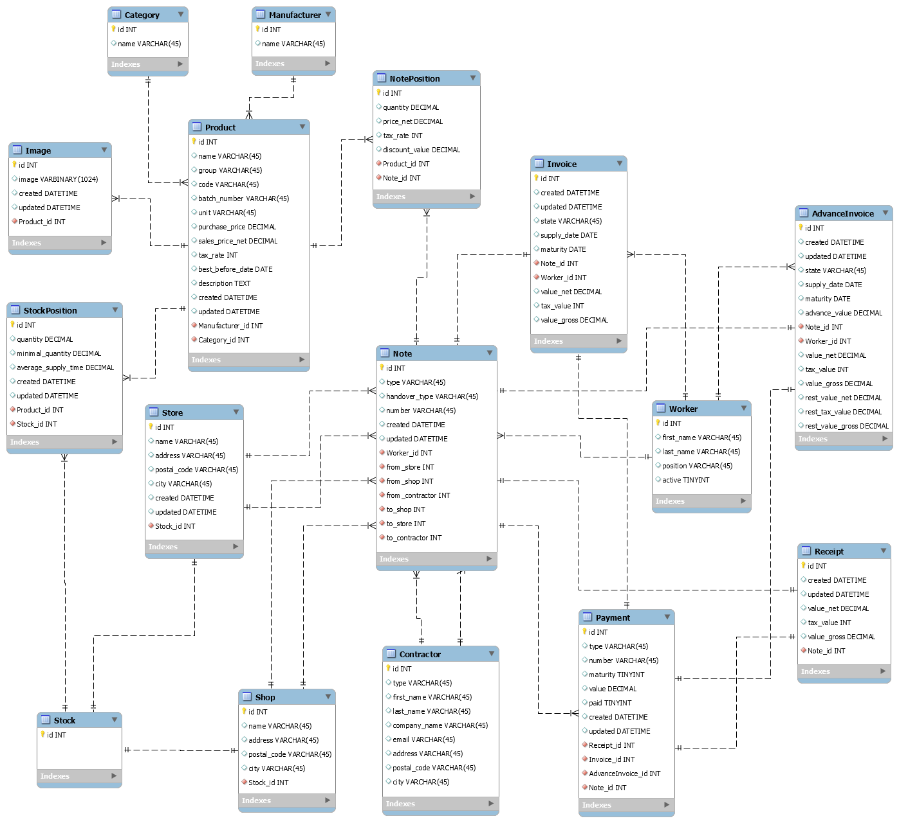

# storage_manager_api

A program for management of the storage. It has a 
database to control the state and flow of products, API for issuing 
invoices and receipts. There will also be an API for issuing storage 
documents, ordering products, checking the state of the storage. 

### Database shema



### Example invoice
```json
{
    "worker": {
        "first_name": "Tom",
        "last_name": "Hagen",
        "position": "seller",
        "active": true
    },
    "note": {
        "number": "EXT-DIS-1",
        "to_contractor": {
            "first_name": "Adam",
            "last_name": "Nowak",
            "company_name": "nowak-invest",
            "email": "nowak@invest.com",
            "address": "Lisia 20",
            "postal_code": "06-312",
            "city": "Cracow"
        },
        "positions": [
            {
                "product": {
                    "name": "Black Tea Lipton",
                    "unit": "pc."
                },
                "quantity": "2.00",
                "price_net": "10.10",
                "tax_rate": 23,
                "discount_value": "0.00",
                "value_net": "20.20",
                "tax_value": "4.65",
                "value_gross": "24.85"
            },
            {
                "product": {
                    "name": "Red Tea Lipton",
                    "unit": "pc."
                },
                "quantity": "5.00",
                "price_net": "15.10",
                "tax_rate": 23,
                "discount_value": "0.00",
                "value_net": "75.50",
                "tax_value": "17.36",
                "value_gross": "92.86"
            }
        ],
        "value_net": "95.70",
        "tax_value": "22.01",
        "value_gross": "117.71"
    },
    "created": "2021-03-17T15:39:22.583263Z",
    "updated": "2021-03-17T15:39:22.583263Z",
    "state": "in_progress",
    "supply_date": "2021-03-20",
    "maturity": "2021-04-16",
    "value_net": "95.70",
    "tax_value": "22.01",
    "value_gross": "117.71"
}
```

### List of endpoints

Adding test data
```
/bills/test_data/
```

Handling receipts
```
Creating receipt
/bills/receipts/create/<note_number>/

Retrieving list of receipts
/bills/receipts/

Retrieving specified receipt
/bills/receipts/<note_number>/

Deleting specific receipt
/bills/receipts/delete/<note_number>/
```

Handling invoices
```
Creating invoice
/bills/invoices/create/<str:note_number>/<int:worker_id>/<int:supply_time>/

Retrieving list of invoices
/bills/invoices/

Retrieving specific invoice
/bills/invoices/<note_number>/

Updating specific invoice
/bills/invoices/update/<str:note_number>/<int:worker_id>/<int:supply_time>/<str:state>/

Deleting specific receipt
/bills/invoices/delete/<note_number>/
```

Handling advance invoices
```
Creating advance invoice
/bills/adv_invoices/create/<str:note_number>/<int:worker_id>/<int:supply_time>/<str:advance_value>/

Retrieving list of advance invoices
/bills/adv_invoices/

Retrieving specific advance invoice
/bills/adv_invoices/<note_number>/

Updating specific advance invoice
/bills/adv_invoices/update/<str:note_number>/<int:worker_id>/<int:supply_time>/<str:state>/<str:advance_value>/

Deleting specific advance invoice
/bills/adv_invoices/delete/<str:note_number>/
```

Exporting data to csv
```
Exporting bills data
/bills/export/

Exporting bills data of specified note
/bills/export/<note_number>/
```
